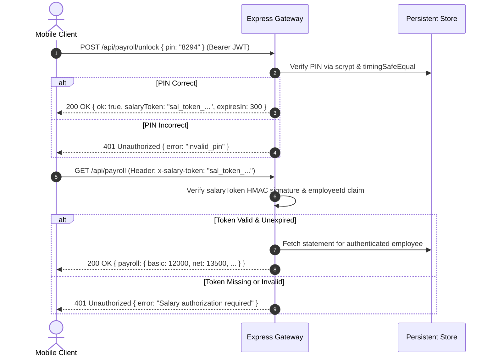

# Elaraby Connect — API Security & Threat Mitigation Specification

**Component:** REST API Gateway & Authentication Protocols  
**Standards:** OWASP API Security Top 10 (2023) Compliant  
**Version:** 1.0.0 (Production API Security)  
**Date:** September 2026  

---

## 1. Threat Model & Security Controls

| Threat Vector | OWASP Classification | Elaraby Connect Mitigation |
| :--- | :--- | :--- |
| **Broken Object Level Authorization (IDOR)** | API1:2023 | All resource mutations (`/api/requests/:id/cancel`, `/api/me`, `/api/payroll`) bind data operations to `req.employee.id` decoded from the verified JWT. Direct user IDs passed in query parameters or request bodies are strictly rejected. |
| **Broken Authentication** | API2:2023 | Dual-factor authentication (National ID + SMS OTP + 4-Digit Security PIN). Cryptographic Scrypt password hashing with unique salts; attempt counters cap failed verifications at 3 attempts. |
| **Broken Object Property Level Auth** | API3:2023 | Request payload validation strips unrecognized or restricted keys (e.g. employees cannot self-assign `vacationBalance`, `tokenVersion`, or `active`). |
| **Unrestricted Resource Consumption** | API4:2023 | Two-tier IP and Account rate limiting (Global: 120 req/min; OTP: 10 req/15 min; PIN: 5 failed attempts locks account for 15 minutes). |
| **Broken Function Level Authorization** | API5:2023 | Strict role enforcement in middleware (`requireAdmin`). Employee tokens cannot access `/api/admin/*` endpoints; Superadmin claims are cryptographically verified. |
| **Server-Side Request Forgery (SSRF)** | API7:2023 | Zero user-supplied outbound URLs accepted for backend fetching; image uploads are processed directly via validated Base64 payloads. |
| **Security Misconfiguration** | API8:2023 | Production boot verifies `JWT_SECRET` is set and >= 32 characters; default development secrets trigger immediate fatal exit. Production disables `devCode` OTP leakage. |

---

## 2. Authentication Protocol & Token Lifecycle

### 2.1 OTP Verification Flow
1. **Request:** `POST /api/auth/otp { nationalId }`
   - National ID must match Egyptian 14-digit format (`EgyptianNationalIdValidator`).
   - If user does not exist, an internal cryptographic constant-time operation is performed before returning `{ found: false }` to thwart timing-based user enumeration.
   - OTP code is generated, hashed with salt, and stored with an expiration of 5 minutes and `attempts = 0`.
   - In production (`NODE_ENV === 'production'`), `devCode` is strictly excluded from the JSON response.
2. **Verification:** `POST /api/auth/otp/verify { nationalId, code }`
   - Maximum 3 attempts permitted. On the 3rd failure, the OTP record is purged and HTTP 429 is returned.
   - On success, issues a temporary `resetToken` authorizing the employee to proceed to PIN creation or verification.

### 2.2 Scrypt PIN Cryptography & Session Versioning
1. **Hashing:**
   - PINs are hashed using Node.js `crypto.scryptSync(pin, salt, 64, { N: 16384, r: 8, p: 1 })`.
   - Salts are 16 bytes of cryptographically secure random bytes generated via `crypto.randomBytes(16)`.
   - Comparison uses `crypto.timingSafeEqual` to eliminate timing side-channels.
2. **Cryptographic Revocation via `tokenVersion`:**
   - Every employee record maintains an integer `tokenVersion`.
   - When a session token is issued, `tokenVersion` is embedded in the JWT payload.
   - If an employee changes their PIN via `/api/auth/pin/change` or an administrator resets access, `tokenVersion` is incremented.
   - In `requireAuth` middleware, incoming tokens are compared with `employee.tokenVersion`. Tokens issued prior to the reset fail immediately with HTTP 401 (`Token has been revoked`).

---

## 3. Salary Slip Authorization Protocol

Salary statements represent highly sensitive financial data and are protected by a dedicated server-side gate:

---

## 4. IDOR Defense Verification

Every state-modifying endpoint enforces caller ownership:

* **Request Cancellation:** `POST /api/requests/:id/cancel`
  - Validates `request.employeeId === req.employee.id`.
  - If a malicious caller attempts to cancel a request belonging to another employee, the backend returns HTTP 403 Forbidden.
* **Profile Updates:** `POST /api/me`
  - Modifies strictly `req.employee.id`. Any injected `employeeId` field in the request body is discarded.
* **Account Deletion:** `POST /api/employee/delete-account`
  - Requires 4-digit PIN confirmation and applies only to `req.employee.id`.
