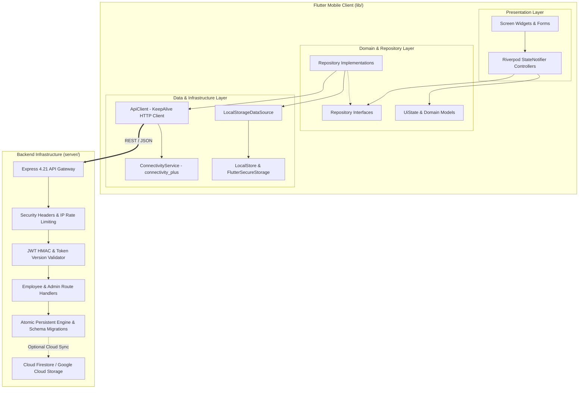
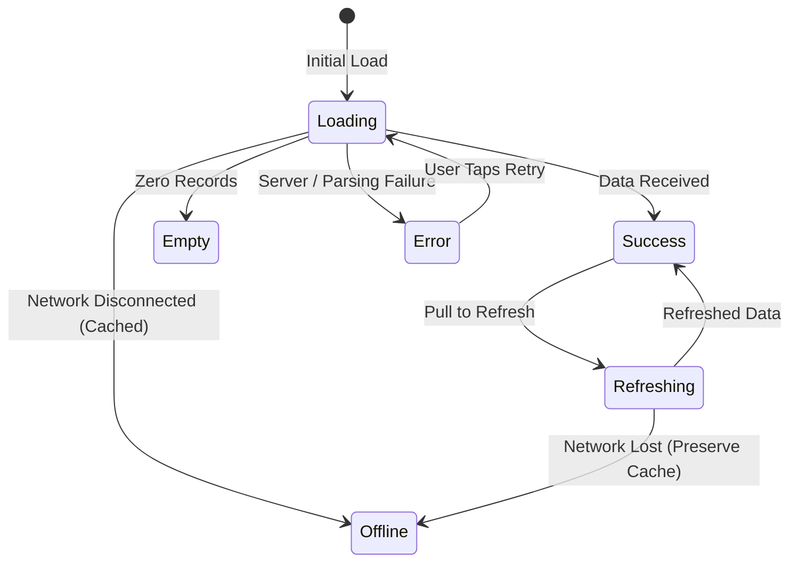

# Elaraby Connect — System Architecture & Design Specification

**Application:** Elaraby Connect (Workforce Management Platform)  
**Target Platform:** Mobile (Android & iOS) + Microservice Backend (Node.js/Express)  
**Version:** 1.0.0 (Production Architecture)  
**Date:** September 2026  

---

## 1. High-Level Architecture Overview

Elaraby Connect employs an **offline-first Clean Architecture** pattern tailored for high-concurrency workforce operations across manufacturing plants. The mobile application provides instantaneous local responsiveness for factory shift workers, gracefully degrading during network drops, and automatically synchronizing when connectivity is restored.



---

## 2. Mobile Architecture & Layering

### 2.1 Feature-First Directory Structure

The codebase is organized by business feature domains to maximize cohesion and minimize cross-boundary coupling:

```
lib/
├── core/
│   ├── data_sources/      # Local and remote low-level abstractions
│   ├── errors/            # Typed domain error hierarchy (AppError)
│   ├── localization/      # Bilingual localization engine & AppLocale
│   ├── navigation/        # Declarative GoRouter configuration & route guards
│   ├── network/           # ApiClient, Backend facade, ConnectivityService, PushService
│   ├── providers/         # Global Riverpod repository & client providers
│   ├── repositories/      # Repository interfaces and implementations
│   ├── state/             # Robust UiState state machine
│   ├── storage/           # LocalStore (SharedPreferences + SecureStorage)
│   ├── theme/             # AppTheme (Light & Factory Night Dark), AppColors, AppTypography
│   └── utils/             # Debouncer, EgyptianNationalIdValidator, UiFeedback
├── features/
│   ├── auth/              # National ID, OTP, PIN creation, Lock screens & controllers
│   ├── home/              # Dashboard, metric cards, today shift, news, announcements
│   ├── services/          # Vacation balance, salary slip, leave requests, concerns, shift schedule
│   ├── benefits/          # Corporate discounts catalog, summer trip booking & cancellations
│   ├── inbox/             # Push notifications inbox & read state tracking
│   ├── profile/           # Employee details, biometric settings, dark mode, PIN change
│   └── main_navigation/   # 4-tab bottom navigation shell with offline status banner
└── l10n/                  # ARB source translation files (app_en.arb, app_ar.arb)
```

---

## 3. State Management Architecture

### 3.1 Riverpod & StateNotifier Pattern

State management is powered by `flutter_riverpod`, separating business logic from rendering:

* **Separation of Concerns:** Screens extend `ConsumerWidget` or `ConsumerStatefulWidget` and observe controllers via `ref.watch(provider)`.
* **Predictable State Transitions:** Controllers extend `StateNotifier<UiState<T>>`, transitioning strictly through predefined lifecycle states:
  * `UiState.loading()`: Initial fetch or active computation.
  * `UiState.success(data)`: Valid state containing verified domain entities.
  * `UiState.empty()`: Successful query with no records (e.g. no pending requests).
  * `UiState.error(message, [cause])`: Explicit failure with user-facing messages (zero silent null returns).
  * `UiState.refreshing(previousData)`: Background refresh preserving active UI data.
  * `UiState.offline(cachedData)`: Device offline while presenting cached records.



---

## 4. Navigation Architecture

### 4.1 Declarative Routing with GoRouter

Navigation is declared in `AppRouter` using `GoRouter`:

* **Single Source of Truth:** Route paths are centralized in `AppRoutes` (e.g. `/`, `/get-started`, `/national-id`, `/main`, `/salary-slip`).
* **Route Guards & Protection:** `AppRouter.redirect` evaluates `AppAuthState` (authenticated vs locked vs unonboarded) on every route evaluation. Unauthenticated attempts to access `/main` or `/salary-slip` are immediately redirected to `/lock` or `/get-started`.
* **Deep Linking & Fallback:** Unknown paths are caught and rendered via `UnknownRouteScreen` (HTTP 404 equivalent).

---

## 5. Offline-First Resilience Architecture

### 5.1 Real Hardware Connectivity Detection
Rather than misinterpreting transient HTTP timeouts as offline mode, the client uses `ConnectivityService` backed by `connectivity_plus`.

### 5.2 Optimistic Offline Queueing & Rollback
1. When submitting a request while offline:
   - Request is assigned a unique local ID (`req_REQ-2026-TEMP...`).
   - Marked with `isPendingSync = true`.
   - Saved locally into `LocalStore` and inserted into `RequestsStore`.
   - Annual leave days are optimistically deducted so the employee cannot over-request.
2. When connectivity is restored:
   - `ConnectivityService` emits an online event.
   - `RequestsStore.instance.flushPending()` is triggered automatically.
   - Requests are processed idempotently by the server (`x-idempotency-key`).
   - If rejected by business policy (e.g. balance exceeded), the deducted days are automatically refunded and the request is marked `rejected`.

---

## 6. Secure Storage & Credential Architecture

* **Hardware Keystore:** Critical security data (PIN hashes, session JWTs) are managed via `FlutterSecureStorage` backed by Android KeyStore (AES-256 GCM) and iOS Keychain (`kSecAccessControlBiometryAny` / `first_unlock`).
* **Plaintext Exclusion:** Plaintext PINs and raw tokens are never written to `SharedPreferences` or logged to disk.
* **Session Teardown:** Unified logout (`Backend.instance.clearAllUserData()`) clears all storage caches, resets vacation balance, wipes in-memory stores, and unregisters push tokens.
