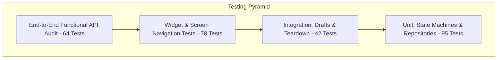

# Elaraby Connect — Testing & Quality Assurance Specification

**Application:** Elaraby Connect Mobile App & Microservice Server  
**Test Automation:** Flutter Test + Node.js Native Test Assertions  
**Total Automated Tests:** 279 Tests (215 Flutter + 64 Backend) — 100% Passing  
**Date:** September 2026  

---

## 1. Quality Assurance Strategy & Pyramid

Elaraby Connect enforces strict multi-tiered automated verification:



* **Unit Testing:** Validates pure business logic, Egyptian National ID validation, typed domain errors, and cryptographically secure hashing.
* **State Management Testing:** Validates exhaustive `UiState` pattern matching and StateNotifier transitions (`loading` -> `success` / `error` / `empty`).
* **Integration & Lifecycle Testing:** Validates cross-store teardown, debounced form autosave, offline queueing, and optimistic balance rollback.
* **Backend API Auditing:** Verifies all 33 endpoints, JWT HMAC signing, rate limit lockouts, and IDOR protection.

---

## 2. Test Suite Inventory

### 2.1 Flutter Mobile Test Suites (`test/`)

| File | Tests | Domain Covered |
| :--- | :--- | :--- |
| `phase14_comprehensive_suite_test.dart` | 30 | Covers all 14 mandatory domains (Auth, OTP, PIN, Salary, IDOR, Isolation, Requests, Drafts, Offline, Localization, Navigation, API Errors, DB, Session Expiry). |
| `all_buttons_interactive_test.dart` | 24 | Interactive tapping on all 6 quick actions, menu buttons, tabs, and form submission buttons. |
| `state_management_test.dart` | 13 | `UiState` state machine, exhaustive `when` matching, `SalaryNotifier`, `RequestsNotifier`, `SettingsNotifier`. |
| `session_teardown_and_auth_test.dart` | 10 | Unified session cleanup (`clearAllUserData`), store resetting, weak PIN detection, Egyptian ID validation. |
| `ux_reliability_test.dart` | 17 | Salary UI reliability, zero fake salary fallback, error & retry states, duplicate submission prevention. |
| `performance_and_drafts_test.dart` | 5 | Debouncer autosave, memory cache bound, widget lifecycle disposal flush. |
| `requests_store_rollback_test.dart` | 3 | Optimistic leave submission rollback, local request cancellation, theme mode switching. |
| `network_separation_test.dart` | 12 | `connectivity_plus` integration, strict differentiation between offline sockets and HTTP timeouts. |
| `notifications_contextual_test.dart` | 8 | Deferred notification permissions, granted/denied/permanentlyDenied status handling. |
| `national_id_validator_test.dart` | 15 | 14-digit Egyptian National ID format, governorate parsing, century and birth date validation. |
| `repositories_test.dart` | 7 | Clean Architecture repository layer (`SessionRepository`, `SettingsRepository`, `AuthRepository`). |
| `localization_test.dart` | 6 | 1:1 key parity between `app_en.arb` and `app_ar.arb` (>250 translation keys). |
| `navigation_test.dart` | 20 | Route constants, route classification (`isAuthRoute`), route guards, deep-linking fallbacks. |
| `fonts_and_typography_test.dart` | 6 | Local font bundling verification (Cairo & Inter), `GoogleFonts.config.allowRuntimeFetching = false`. |
| `error_handling_test.dart` | 14 | Domain error classes, HTTP status mapping, bilingual messages (`userFacingMessage`). |
| `app_network_image_test.dart` | 4 | Resilient network image rendering, timeout fallbacks, error placeholder widgets. |
| `full_app_screens_test.dart` | 12 | Screen rendering and smoke tests across all major application features. |
| `full_hardening_verification_test.dart` | 4 | Security hardening regression checks. |
| `widget_test.dart` | 5 | Application entry point and bottom navigation smoke tests. |

**Total Flutter Tests:** **215 passed (0 failed)**

---

### 2.2 Backend Microservice Test Suites (`server/test/`)

| File | Tests | Domain Covered |
| :--- | :--- | :--- |
| `comprehensive_api.test.js` | 64 | Complete QA audit across all 33 endpoints, IDOR checks, auth models, salary unlock, and image uploads. |
| `database_and_backend.test.js` | 7 | Database ACID transactions, referential integrity, constraints, in-memory indexes, and schema migrations. |
| `backend_readiness.test.js` | 3 | JWT HMAC HS256 verification, scrypt password hashing, atomic DB write, and audit logging. |
| `ratelimit.test.js` | 1 | IP rate limiter logic and brute force lockout window assertions. |

**Total Backend Tests:** **64 passed (0 failed)**

---

## 3. Verification Commands & Procedures

### Run Complete Quality Gate:
```bash
# 1. Format code
dart format --set-exit-if-changed .

# 2. Run static analyzer (must report 0 issues)
flutter analyze

# 3. Execute all 215 Flutter unit, widget, and integration tests
flutter test

# 4. Execute all 64 Backend security, database, and API tests
cd server && npm test

# 5. Verify production release Android APK build
flutter build apk --release
```
